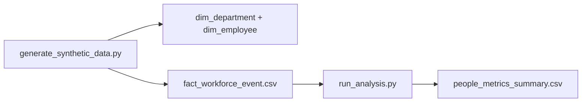

# HR Analytics One-Model Lab (Synthetic)

**Author:** Faiz Elahi · **Type:** EDUCATIONAL PORTFOLIO LAB · **SYNTHETIC DATA ONLY**

---

## Educational disclaimer / synthetic data

This lab uses **synthetic employees, departments, and workforce events**. No employer HRIS export, compensation files, or real people are included. Demographic fields are **labeled proxies** for teaching only.

Use honest language: *“I built a single DuckDB people mart for headcount and turnover on synthetic HRIS-style data.”*

---

## Problem statement (detailed)

People analytics teams consolidate HRIS feeds into **one semantic model** for headcount, hiring, termination, and diversity monitoring (with strict governance in production). Common questions:

- Active **headcount by department**
- **Turnover rate** over a window
- **Event timeline** (hire, promotion, termination) at employee grain

This lab keeps scope intentionally narrow—**one DuckDB database** joining `dim_employee`, `dim_department`, and `fact_workforce_event`—so students practice SQL marts before touching Workday/SuccessFactors integrations.

---

## Why this tool

| Spreadsheet headcount | This lab pipeline |
|-----------------------|-------------------|
| Stale pivot tabs | Version-controlled `run_analysis.py` |
| Inconsistent active flag | Explicit `is_active` and termination dates |
| No event grain | Workforce events table for lifecycle |

Pairs with **`oci-data-platform-lab`** (HCM extract metaphor) and **`azure-health-data-platform-lab`** (medallion transforms).

---

## Architecture



See [`docs/architecture.md`](docs/architecture.md).

---

## Dataset dictionary (tables / columns)

| File | Grain | Key columns | Notes |
|------|-------|-------------|-------|
| `dim_department.csv` | Department | `department_id`, `department_name`, `cost_center` | Five departments |
| `dim_employee.csv` | Employee | `employee_id`, `hire_date`, `department_id`, `manager_id`, `job_level`, `gender`, `ethnicity_proxy`, `fte`, `is_active`, `termination_date` | ~800 employees |
| `fact_workforce_event.csv` | Event | `event_id`, `employee_id`, `event_type`, `event_date` | Hire/promo/term events |
| `people_metrics_summary.csv` | Snapshot | Headcount, turnover metrics | Output after run |

---

## Prerequisites

- Python 3.10+
- `duckdb`, `pandas`, `matplotlib` (see `requirements.txt`)

---

## Step-by-step: how to run

### Windows PowerShell

```powershell
cd hr-analytics-one-model-lab
python -m venv .venv
.\.venv\Scripts\Activate.ps1
pip install -r requirements.txt
python scripts/generate_synthetic_data.py
python src/run_analysis.py
```

### Optional bash

```bash
cd hr-analytics-one-model-lab
python3 -m venv .venv && source .venv/bin/activate
pip install -r requirements.txt
python scripts/generate_synthetic_data.py
python src/run_analysis.py
```

---

## File-by-file walkthrough

| Path | Role |
|------|------|
| `scripts/generate_synthetic_data.py` | Departments, employees, lifecycle events |
| `src/run_analysis.py` | Builds DuckDB mart, metrics CSV, headcount/turnover charts |
| `data/people_metrics_summary.csv` | Summary metrics export |
| `docs/images/` | Headcount and turnover charts (created on run) |

---

## Expected outputs and how to interpret them

- **Console tables** — Active headcount by department from SQL on `is_active = TRUE`.
- **Turnover views** — Terminations relative to average headcount (see script definitions).
- **`people_metrics_summary.csv`** — Single-row or small summary for dashboards.
- **PNG charts** — Department headcount bar chart and turnover visualization.

Synthetic **ethnicity_proxy** and **gender** fields exist for teaching joins—not for real DEI reporting without governance.

---

## Results interpretation

- **Point-in-time headcount** depends on active flags vs event reconstruction—compare both in exercises.
- **Manager_id** may be null for some rows—discuss org hierarchy data quality.
- Small departments show **volatile turnover rates** from random synthetic terms.

---

## Glossary (8+ terms)

1. **HRIS** — Human resource information system.
2. **Headcount** — Count of active employees at a reference date.
3. **Turnover rate** — Separations divided by average headcount in a period.
4. **FTE** — Full-time equivalent employment fraction.
5. **Workforce event** — Hire, promotion, termination, or transfer row.
6. **One-model** — Single semantic layer for people metrics (this lab’s scope).
7. **Cost center** — Finance alignment on department dimension.
8. **Point-in-time** — Snapshot logic vs slowly changing dimensions.
9. **Ethnicity proxy** — Synthetic teaching column—not EEO-1 submission data.

---

## Common mistakes (5+)

1. Presenting **synthetic diversity metrics** as real employer outcomes.
2. Double-counting **employees** when joining to multiple event rows without deduping.
3. Using **termination_date** without filtering **is_active**.
4. Ignoring **part-time FTE** when comparing department size.
5. Claiming **Workday/SAP integration** from this local CSV lab.
6. Storing **manager cycles** in hierarchy without graph validation.

---

## Exercises (5+)

1. Rebuild headcount using **events only** and compare to `is_active`.
2. Compute **12-month rolling turnover** by department.
3. Add **job_level** pyramid chart export.
4. Flag **orphan manager_id** references not in employee table.
5. Document **GDPR/HR retention** policies for real HRIS pipelines (conceptual).
6. Join theme to **`oci-data-platform-lab`** `hcm_employees.csv` metaphor in a diagram.

---

## Limitations / simulation vs production

- No compensation, performance ratings, or recruiting funnel.
- Synthetic demographics—not statistically representative.
- Local DuckDB only—no row-level HR security policies.
- Educational code—**not workforce compliance reporting**.

---

## Related labs

- [`oci-data-platform-lab`](../oci-data-platform-lab/) — HCM bronze files metaphor.
- [`azure-health-data-platform-lab`](../azure-health-data-platform-lab/) — Medallion clinical/ops pattern (compare transforms).
- [`dbt-healthcare-marts-lab`](../dbt-healthcare-marts-lab/) — dbt testing mindset for marts.

---

**Author:** Faiz Elahi · Educational portfolio use.
